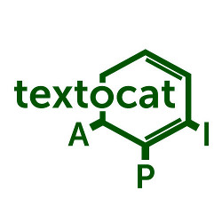

Official Java SDK for Textocat API
==================================
[](http://textocat.com)

Integrate Textocat API easily into your Java application
--------------------------------------------------------
The project features native integration with [Textocat API](http://docs.textocat.com) in Java. All calls to API are asynchronous. The SDK is built on top of Mashape's [Unirest](http://unirest.io), Google's [Guava](https://github.com/google/guava) and [Gson](https://github.com/google/gson).


Latest Version
--------------
[1.0](https://github.com/textocat/textocat-java-sdk/archive/1.0.zip) (with support of Textocat API 0.3)

Features
--------
* entity recognition (ER)
* full-text search (with [support of ER annotations](http://docs.textocat.com/search-query-syntax.pdf))
* Russian language

Authorization token
-------------------
To take advantage of the SDK, you must have an authorization key (authToken). [Get](http://textocat.com/#idSubscribe) one  for free!

Prerequisites
----------------------
* Java 1.7+

How to use for entity recognition
---------------------------------
```java
final EntityRecognition entityRecognition = TextocatFactory.getEntityRecognitionInstance("<YOUR_AUTH_TOKEN>");
final FutureCallback<AnnotatedBatch> outputCallback = // a callback for dealing with annotated documents ...
        FutureCallback<BatchMetadata> inputCallback = new FutureCallback<BatchMetadata>() {
            public void onSuccess(BatchMetadata batchMetadata) {
               entityRecognition.retrieve(outputCallback, batchMetadata);
            }
            public void onFailure(Throwable throwable) {}
        };
entityRecognition.submit(new Batch(documents), inputCallback);
```


Mailing list
------------

Have a question or a suggestion? Please join our [user forum](http://feedback.textocat.com).

Development and Contribution
----------------------------

Developed in [Textocat](https://github.com/textocat). If you find any bug or would like to suggest an improvement, feel free to submit pull requests into develop branch.


License
---------------------

Licensed under the Apache License, Version 2.0: http://www.apache.org/licenses/LICENSE-2.0
